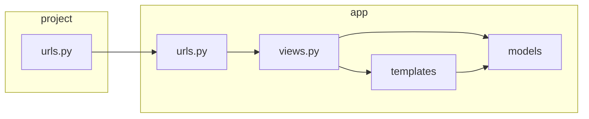

## django请求处理流程图

## 静态文件服务
### 开发模式下
在settings中将debug设置为true即可
```python
DEBUG = True
```
### 生产模式下
在settings.py中设置
STATICFILES_DIRS 定义了django会在除app中的static目录外查找静态文件的目录，这个目录位置不能跟STATIC_ROOT重复、
比如
```
STATICFILES_DIRS = [
    BASE_DIR / "static",
]
```
定义了静态文件位于项目文件夹中的static文件夹

```python
STATIC_URL = 'static/'
```
定义了URL中static/开头的地址指向静态文件
比如在模版中使用
```html

```
代表静态文件位于项目文件夹中的static/img/bg.png

如有需要的话可添加STATIC_ROOT
```
STATIC_ROOT = "collectedstatic/"
```
在运行'python manage.py collectstatic'命令时将静态文件搜集到此目录

## 用户上传文件服务
### 开发模式下
在**根目录**urls.py(也就是项目同名app中的urls.py)  
参考官网: https://docs.djangoproject.com/zh-hans/4.1/howto/static-files/#serving-uploaded-files-in-development  
```python
urlpatterns +=static(settings.MEDIA_URL, document_root=settings.MEDIA_ROOT)
```
### 生产模式下
在settings.py中设置  
参考官网: https://docs.djangoproject.com/zh-hans/4.1/ref/settings/#std-setting-MEDIA_ROOT
```python
MEDIA_ROOT = 'media/'
```
定义了用户上传的文件位于项目文件夹内的media文件夹
```python
MEDIA_URL = 'media/'
```
定义了URL中media/开头的地址指向用户上传的文件


## 内置模版标签和过滤器
参考: https://docs.djangoproject.com/zh-hans/4.1/ref/templates/builtins/#ref-templates-builtins-filters
### date 过滤器
如果模型中的数据类型是datetime而只想输出年月日,则可以使用date过滤，比如

我在模型中定义的字段类型
```python
class Post(models.Model):
    created_time = models.DateTimeField(auto_now=False, auto_now_add=True)
```
我在模版中只想显示年月日则可以用如下语法
```python
{{post.created_time|date:"Y-m-d"}}
```

## 增加markdown支持
安装markdown
```python
pip install markdown
```

假设models.py中定义的字段如下
```python
class Post(models.Model):
    title =  models.CharField("标题",max_length=50,blank=True,null=True)
    content_md = models.TextField("内容(markdown格式)",blank=True,null=True)
```
则views.py如下
```python
def post_detail(request,title):
    post = Post.objects.get(title=title)
    md = markdown.Markdown(extensions=[
        'markdown.extensions.extra',
        'markdown.extensions.codehilite',
        'markdown.extensions.toc',
    ])
    content = md.convert(post.content_md)
    return render(request,'post_detail.html',context=({'post':post,'content':content,'toc':md.toc}))
```
context传递的post是url传递过来的title所对应的post对象，content是内容（已经转换成html），toc是目录  
模版文件post_detail.html中可以使用如下方式
```html
{{post.title}}
{{content|safe}}
{{toc|safe}}
```
### 添加表格边框
可以看到html源码中markdown为生成的内容添加了如下标签
```html
<article class="blog-post">
```
所以在css样式中可以这样
```css
.blog-post table,tr th,tr td {
  border: 1px solid;
}
```


