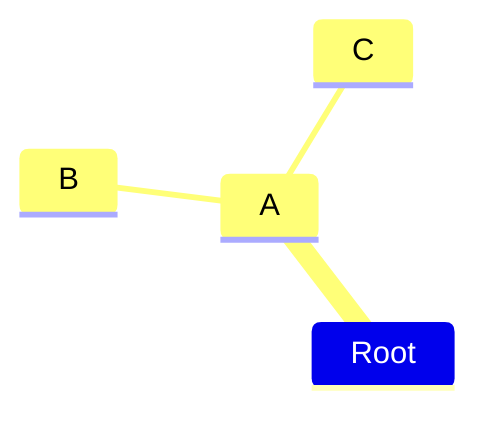

# 插件
## Mermaid 
JavaScript based diagramming and charting tool that renders Markdown-inspired text definitions to create and modify diagrams dynamically.
https://mermaid.js.org/

### Mindmaps
An example of a mindmap.

## foam
Foam is a personal knowledge management and sharing system inspired by Roam Research, built on Visual Studio Code and GitHub.
支持双链等功能