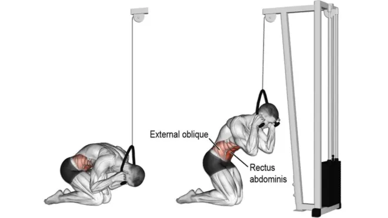
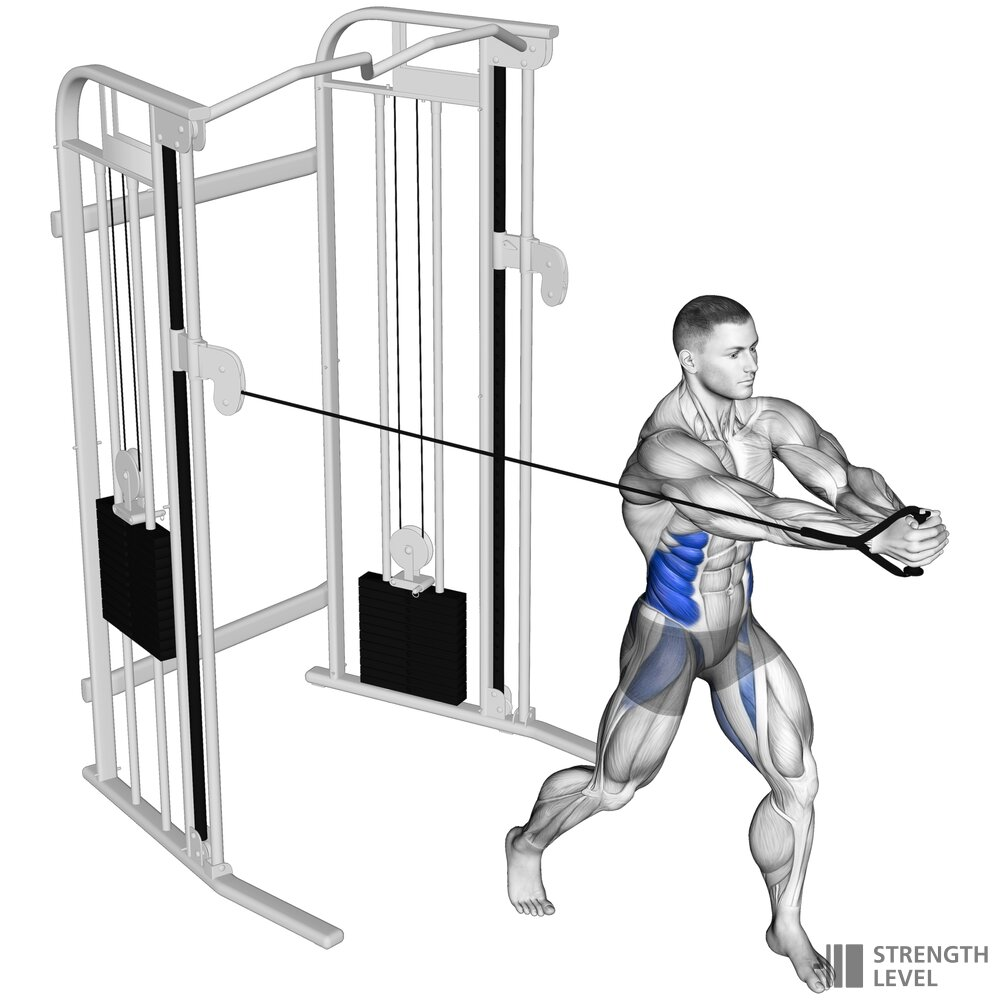
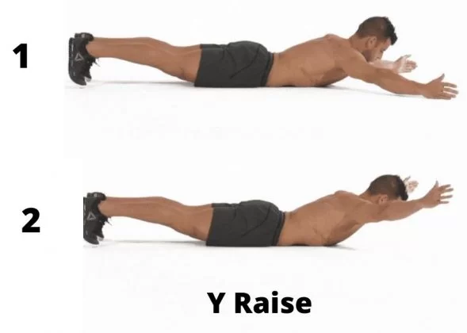
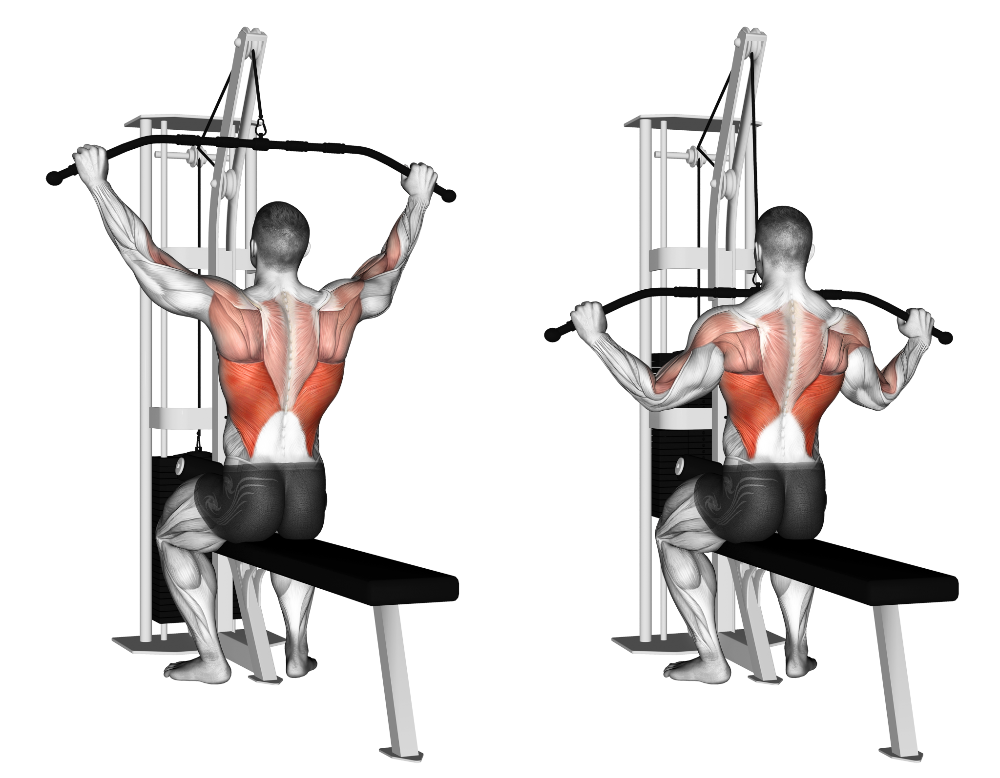
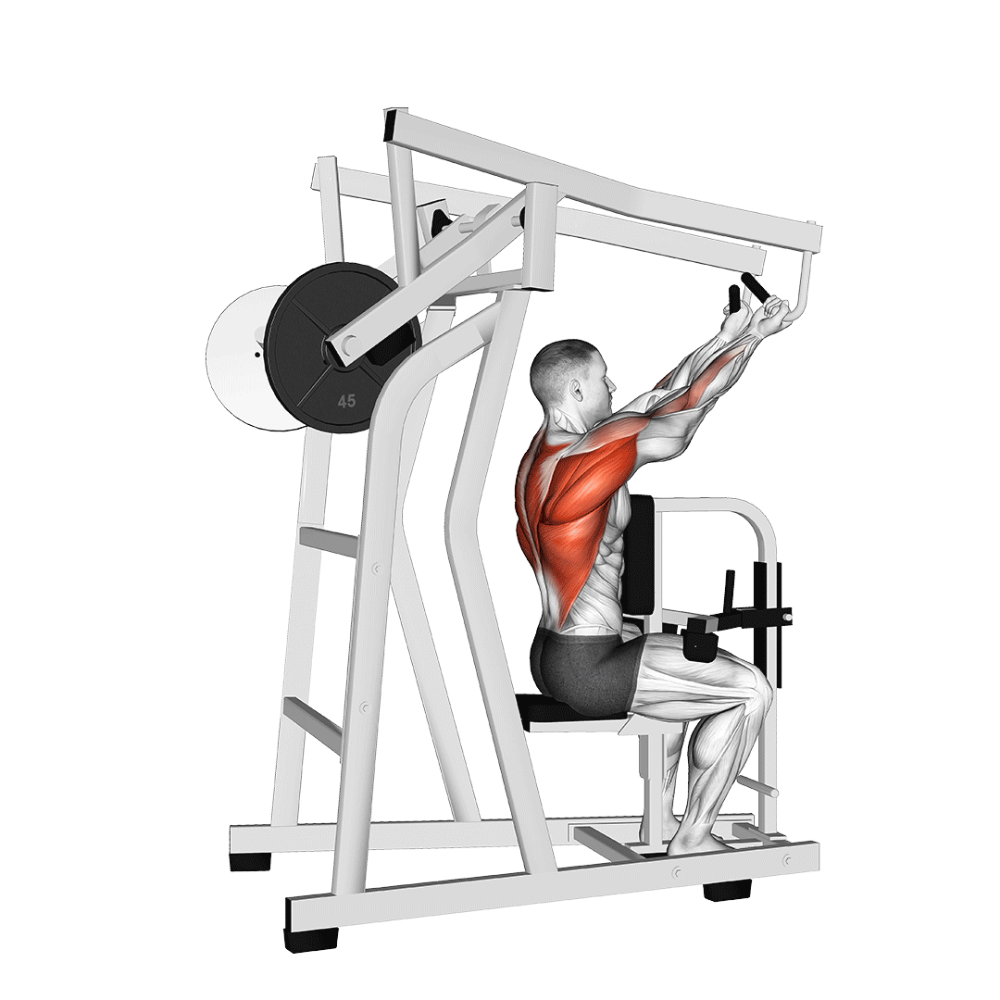
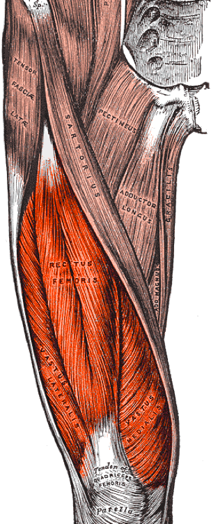
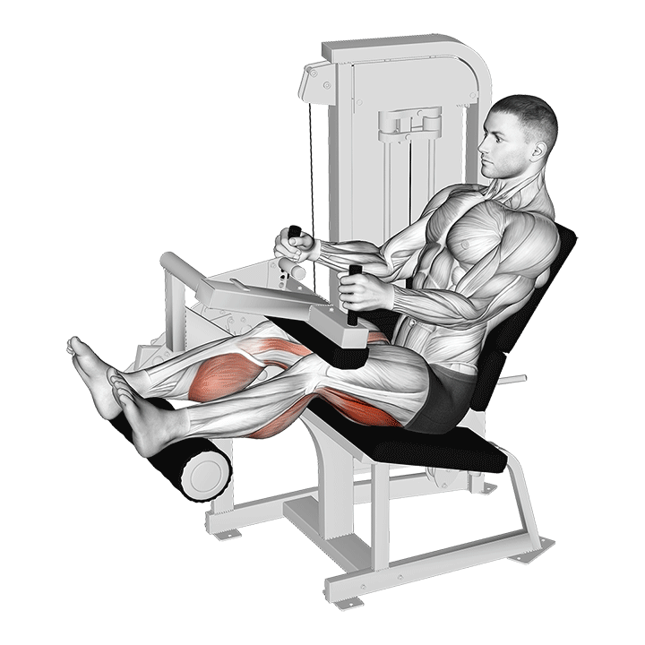

## Chest 胸
## abs 腹
#### Hanging Leg Raises
#### Russian Chair Leg Raises

#### Hanging Knee Raises
 
#### Hanging Side Knee Raise
 
#### Cable Crunch

#### Cable Woodchoppers

#### Weighted oblique twists

## Back 背
### Trapezius 斜方肌

#### Shrugs 耸肩等肩胛骨上提动作  锻炼上部

#### Row 划船等肩胛骨后缩动作  锻炼中部

#### Y Rise Y上举  锻炼下部

### Rhomboid 菱形肌

#### Inverted-Row

#### Reverse-Cable-Crossover

### infraspinatus 冈下肌

### Teres minor 小圆肌

### Teres major 大圆肌

### Latissimus Dorsi 背阔肌

Vertical pulling movements such as pull-downs and pull-ups (including chin-ups)  
Horizontal pulling movements such as bent-over row, T-bar row and other rowing exercises  
Shoulder extension movements with straight arms such as straight-arm lat pulldowns and Pull-overs  
Deadlift  
#### actions
      

## Glutes&legs 臀腿
### Gluteus maximus  
  
### Gluteus medius  
 
#### actions

### Gluteus minimus  
  

### Quadriceps 四头肌

#### Leg extension

### Hamstring 大腿后肌群
### Semitendinosus  
  
### Semimembranosus 

### Biceps femoris 股二头肌  
  

#### lying-leg-curl  
  
#### seated-leg-curl  
  

#### Paused Barbell Hip Thrust
  
#### Leg Press  
  
#### Free Weight Squats
  
#### Weighted Bulgarian Split Squats
  

