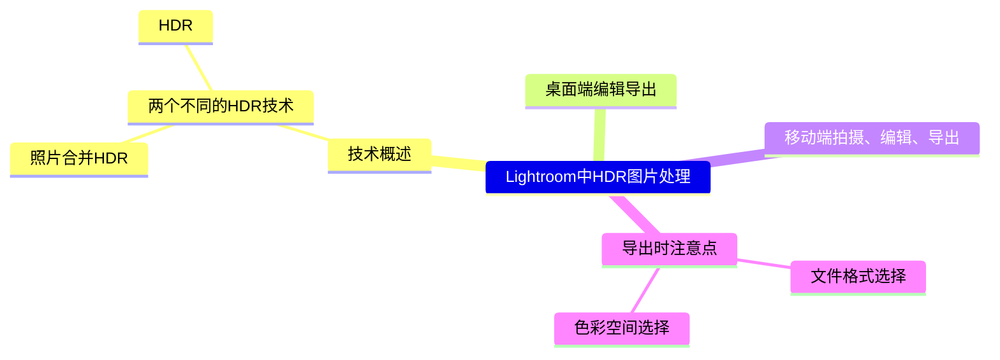

# Video
## 脑图

## 文稿

终于,Adobe更新Lightroom,支持HDR编辑和导出
先前版本的照片合并HDR是需要多张不同曝光的照片
而这次更新的HDR编辑直接把照片的亮度和色彩范围大幅提升
点击照片,进入修改照片模块-点击HDR,然后导出
这样你就完成了一张HDR照片的制作
当然你也可以对照片进行一些调色
导出的格式选择avif或jpegxl,颜色空间目前只推荐rec2020
因为rec709对比度低画面发灰,p3在iphone相册里会抽风

接下来介绍一下使用lightroom移动端进行拍摄、编辑、导出HDR照片的流程
我用的是iphone13,打开lightroom,点击拍照,通常我会点击上部中间这个地方选择文件格式为DNG,这是Raw格式,然后在拍摄模式这里选择合适的,自动-专业-高动态范围,这三个模式对应数码相机上的自动档、手动挡、HDR照片,这三个模式只是可调整参数上的一些区别.这里我选择自动档,拍摄一张照片.然后我退到上一个界面,可以看到我拍摄的照片,点击打开,点击编辑-亮度(往下滑)-勾选上“在HDR模式中编辑”.可以明显看到图片呈现内容上的变化,我对照片进行简单的调整后,准备导出.点击导出图标,选择导出为avif,选择存储图像即保存到相册中了.当然你也可以使用相册中已有的照片进行编辑,操作步骤是一样的.

## 评论
不知为何macOS用软件录屏,不管是用自带录屏软件还是obs录出来都没有HDR效果,iOS打开录屏后lightroom的HDR编辑都失效了,知道解决办法的小伙伴麻烦指点一下啦

# Reference:
## HDR照片浏览 
HDR Test Photos (AVIF/AV1)：https://people.csail.mit.edu/ericchan/hdr/hdr.php  

## lightroom HDR编辑和导出官方文档
Edit and Export in HDR: https://helpx.adobe.com/lightroom-classic/help/hdr-output.html  

## 技术相关
Embedded Gain Maps for Adaptive Display of High Dynamic Range Images: https://www.youtube.com/watch?v=HBVBLV9KZNI  
ISO/TS 22028-5:2023 High dynamic range and wide colour gamut encoding for still images (HDR/WCG)：https://www.iso.org/standard/81863.html  
Gain Map：https://helpx.adobe.com/camera-raw/using/gain-map.html  
Explore EDR on iOS：https://developer.apple.com/wwdc22/10113  
Google I/O Ultra HDR：https://www.youtube.com/watch?v=sv9ICtooWBc  
Ultra HDR Image Format v1.0：https://developer.android.com/guide/topics/media/hdr-image-format  

## 扩展阅读
iPhone 相机拾遗：https://www.bilibili.com/read/cv14886284  
微博 HDR 视频的落地实践：https://mp.weixin.qq.com/s/y__pTZ9c1mwM-L1rbr6gpw  
西瓜视频是如何实现“端到端 HDR”的 | Q推荐：https://mp.weixin.qq.com/s/i7thVrH4suaJdI52RFUKhA  
三十分钟色彩科学——Apple EDR + Metal：https://mp.weixin.qq.com/s/EgJkGimBs5AF1n3O4KqYog  