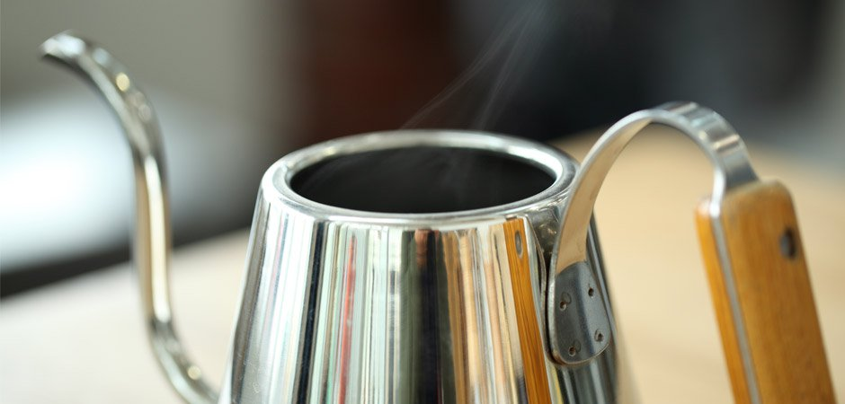

## 手冲
### 摘要
用手冲的方式来制作一杯咖啡，类似一场冥想  
没有嘈杂的声音  
用一些简单的工具  
花几分钟让自己慢下来  
参考值: 水粉比 1:12-18  水温 88-94°C  
### 步骤
#### 第一步 准备热水 
事先预估即将使用到的水并煮沸，其中包括冲洗器具的用量

#### 第二步 准备咖啡粉  
将20g豆子磨成白砂糖颗粒大小

#### 第三步 预热  
将滤杯放上分享壶，滤纸放入滤杯，用少量热水预热

#### 第四步 倒粉
将预热好的套装放至电子秤，归零，倒入咖啡粉，拿起滤杯轻拍将粉拍平

#### 第五步 闷蒸
将电子秤归零，计时器开启，用40g(两倍粉量)的水焖蒸30秒左右（以中心向外扩散绕圈的方式去打湿所有咖啡粉）

#### 第六步 萃取
以绕圈的方式注入水至120g，这样的方式使水流起到轻微搅拌的作用，让咖啡粉更均衡萃取

#### 第七步 完成
在1分30秒左右，以中心定点方式注水至300g，等待滤杯中水面降至咖啡渣底床完成萃取，总体时间2分30秒左右

## 法压
### 摘要

法压的浓醇厚重是它特有的气质  
参考值: 水粉比 1:12-15  水温 88-94°C  
### 步骤
#### 第一步 准备热水
事先预估即将使用到的水并煮沸，其中包括冲洗器具的用量

#### 第二步 准备咖啡粉
在烧水的过程，你可以将你的豆子研磨比手冲较粗的颗粒，一般四杯量的法压壶准备30g豆子即可

#### 第三步 冲泡萃取
将热水倒入法压壶至金属框处，将盖子盖上，此时不需要将杆子压下，等待4分钟

#### 第四步 完成
压下滤网，将咖啡倒入杯中

