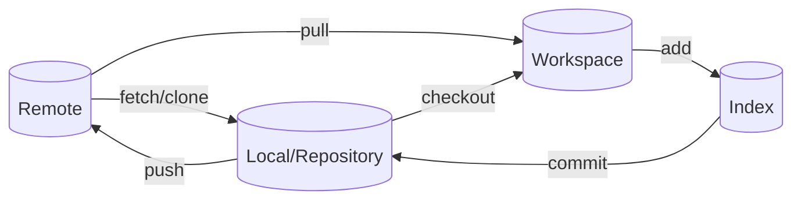

## 基本控制操作


## git 撤销操作不同命令图示
|命令|Working Directory|Staging<br>(index)|Repository|
|---|---|---|---|
|git checkout<changed_file><br>(git restore <changged_file>) |x||
|git reset<changed_file><br>(git restore --staged <changed_file>) ||x|
|git checkout HEAD <changed_file>|x|x||
|git reset --soft HEAD~1|||x|
|git reset HEAD~1||x|x|
|git reset --hard HEAD~1|x|x|x|

## 命令
 `git config`
这是运行git前需要进行的配置，每台计算机只需要配置一次，程序升级时会保留配置信息。通过git config来配置变量，这些变量存储在三个不同的位置.  
`git config --system`
带'--system'选项的，会读写'/etc/gitconfig'文件，包含系统上每一位用户及他们的仓库的通用配置.  
`git config --global`
带'--global'选项的，会读写'~/.gitconfig' 或 '~/.config/git/config' 文件,针对当前用户的所有仓库.  
例如: 如下代码配置你的用户名和邮箱  
```sh
git config --global user.name "xxx"
git config --global user.email "xxx@xxx.xxx"
```
`git config [--local]`
带'--local'选项，也就是默认的选项，会读写'.git/config'文件,针对该仓库.

`git config --list ` 
查看当前用户的配置
如需查看所有配置及它们所在的文件可使用如下命令
```sh
git config --list --show-origin
```

`git config --global init.defaultBranch`
设置默认主分支名称，github,macos默认已经改成main.  
By default Git will create a branch called _master_ when you create a new repository with `git init`. From Git version 2.28 onwards, you can set a different name for the initial branch.

To set _main_ as the default branch name do:
```sh
git config --global init.defaultBranch main
```


`git init` 初始化仓库  
Initializing a Repository in an Existing Directory  
创建文件夹然后初始化仓库  
```sh
git init
```

`git clone` 克隆仓库  
Cloning an Existing Repository  
克隆一个已存在的仓库  
You clone a repository with `git clone <url>`. 
```sh
git clone https://github.com/xxx/xxx
```

`git add <Filename>`添加要追踪的文件

`git status` 查看文件的状态

`git diff` 查看被修改文件的修改前后差异

`git commit` 提交修改

`git commit -m` 带注释提交
```sh
git commit -m "the commit message for your changes"
```

`git commit -a -m` 将已经添加到暂存区的直接提交
Skipping the Staging Area 省略添加到暂存区直接提交  
```sh
$ git commit -a -m "the commit message for your changes"
```

`git restore` 恢复工作区文件  
恢复未add的文件，和老版本中checkout一样的作用

`git restore --staged <filename>` 撤销添加到暂存区的文件  
跟git-reset一样用法，撤销add到staged的文件，也就是删除掉暂存区的文件，保留磁盘修改的内容

`git reset` 移动HEAD到指定位置

`git rm ` Removing Files 删除暂存区中的文件

`git mv` Moving Files 移动暂存区中的文件

`.gitignore` 此文件内容为忽略跟踪的文件

`git branch` 查看本地分支

`git branch -r` 查看远程分支

`git branch -a` 查看所有分支

`git branch <branch_name>` 创建新的分支（但不会切换到新的分支）

`git switch <newbranch>` 切换到新的分支

`git branch -d(--delete) <branch_name> `删除分支(会提示错误信息)

`git branch -D <branch_name>` 删除分支（强制） 
强制删除，不会提示错误信息，不能删除当前所在分支

`git checkout [<branch>]` 切换到新的分支或恢复工作区文件

`git checkout -b <branch_name>` 创建分支并切换到新的分支

`git log` 查看提交历史

`git remote` 查看远程仓库

`git remote -v` 查看远程仓库的url

`git remote add <shortname> <url>` 添加远程仓库

`git remote rename <old> <new>` 重命名和删除远程仓库

`git remote remove <name>` or `git remote rm <name>` 删除远程仓库

`git fetch` 从远程仓库拉取（后续需要手动merge）

`git pull` 从远程仓库拉取并合并

`git push <remote> <branch>` 提交到远程仓库

`git push <remote> -d <branch>` 删除远程分支


## Tips
github下载zip是没有版本历史的  
2021年之后已经不只是用户名密码来push了，只能通过tokens


## reference
https://git-scm.com/docs
